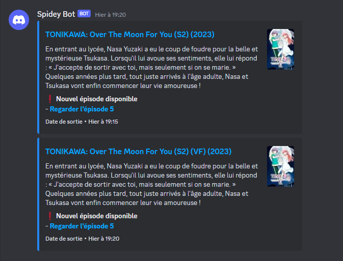
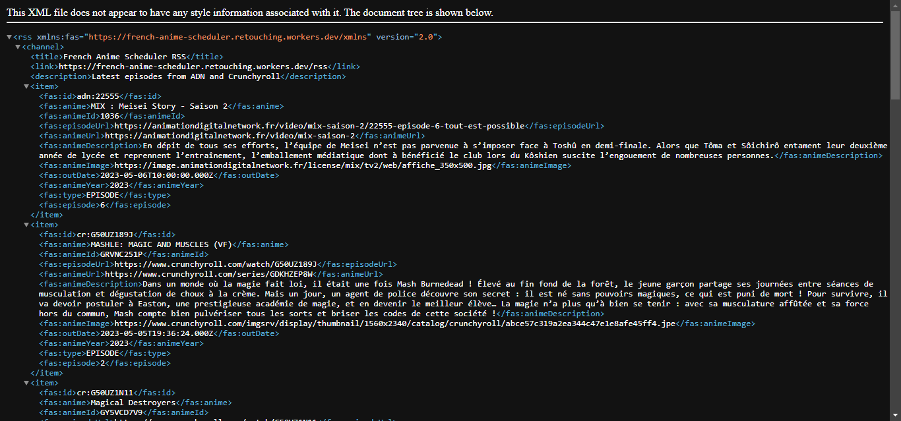

<div>
    <h1 align="center">French Anime Scheduler</h1>
</div>

<br>

Announce when new episodes (in french) are available from [ADN](https://animationdigitalnetwork.fr) and [Crunchyroll](https://crunchyroll.com)

<h2>Requirements</h2>

- **wrangler**

<h2>Installation</h2>

```shell
$ git clone "https://github.com/retouching/french-anime-scheduler.git"
```

```shell
$ cd french-anime-scheduler
```

```shell
$ npx wrangler push
```

<h2>Configuration</h2>

```toml
name = "french-anime-scheduler"
workers_dev = false
main = "src/index.ts"
compatibility_date = "2023-06-05"
kv_namespaces = [
  { binding = "DB", id = "xxx" }
]

[vars]
WEBHOOK_URL = "https://discord.com/api/webhooks/xxx/xxx"
MENTIONS = "xxx,xxx"

[triggers]
crons = ["1,6,11,16,21,26,31,36,41,46,51,56 * * * *"]

```

`name`: Name in cloudflare workers panel

`workers_dev`: Enable RSS page

`kv_namespaces`: DB to use, you can generate an id token with:

```sh
$ wrangler kv:namespace create [DBNAME]
```

and copy id to config

`WEBHOOK_URL`: Webhook to use for sending new episodes

`MENTIONS`: Roles to mention, separate with a coma. (Empty string if no mention needed)

<h2>Demo</h2>




<h2>Warning: Some things need to be considered</h2>

 - This project is not approved by ADN and Crunchyroll
